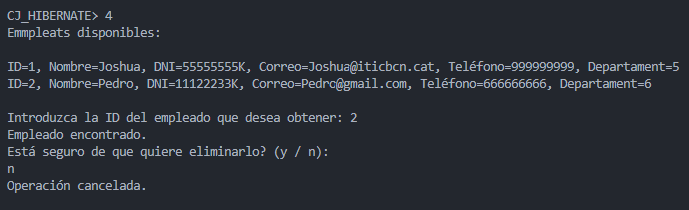
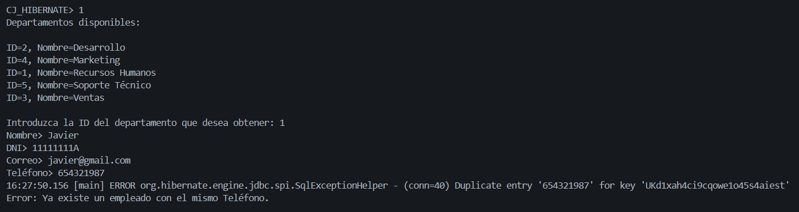
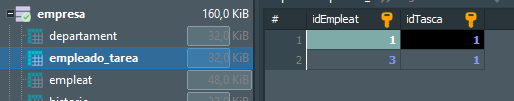
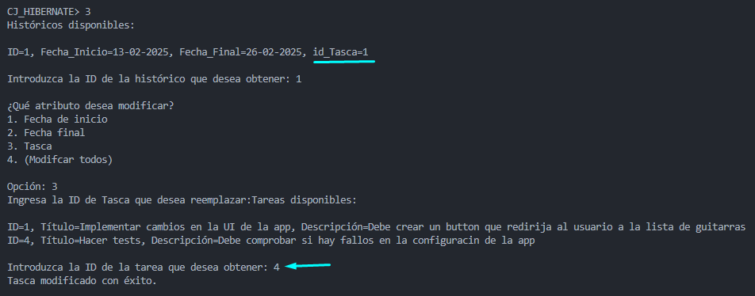

# M06-UF2-ACT-03

> **Nota:** ejecute **chcp 65001** en la consola donde se ejecutará el programa para habilitar el UTF-8 temporalmente (si no lo tenía activado)

# Main

Para poder gestionar las tablas de la base de datos, se utilizará este prompt personalizado, que nos redijirá a la tabla que desea el usuario.  
> **Nota:** la opción para salir o ir a un paso atrás siempre será -> **;**

   

 

# DEPARTAMENT

Al selecionar la opción 1 en el main, entrará a la tabla Departament.

   

 

- **CREAR** 

Para crear un departamento solo basta con ponerle un nombre. Si el nombre introducido está vacío, volverá a esperar hasta que se le asigne uno. 

   

 

- **ENCUENTRA**

Para encontrar la ID que se necesita, primero se mostrará un listado con todos los departamentos existentes. Si no exite ninguno, volverá al prompt de Departament.

Si existen registros se le pedirá al usuario que introduzca la ID del departamento que necesite adquerir, si la ID que se introduce no es la esperada, se manejará la excepción y volverá a esperar hasta que se le de una ID correcta.  

Por último, se mostrará el nombre del departamento.

   

 

- **MODIFICA**

Al escoger la opción de modificar un departamento, se llamará al método que muestra todos los departamentos y luego a otro método manejará las excepciones hasta que se inserte la ID correcta.

Como la tabla Departament solo tiene una columna, que es **nombre**, se le pedirá al usuario uno nuevo (no acepta nombres vacíos).

Si todo la modificación se hace correctamente, se mostrará un mensaje de confirmación.

   

 

- **REMOVE**
  
Al escoger la opción de eliminar, se muestran todos los registros existentes y se ecogerá la ID del departamento que el usuario desea eliminar.

Al escoger una ID existente, se le pedirá al usuario la confirmación para eliminar el departamento.   
Si la respuesta es **"y"**, se procederá a la eliminación y mostrará un mensaje de confirmación. 

   

 

Si la respuesta es **"n"** como en este caso, se cancelará la eliminación del departamento seleccionado.

   

 

- **EXCEPTION DUPLICATE**

> **Nota:** logré manejar la excepción de duplicado, pero no pude desaparecer el log de Error de duplicado del sqlExceptionHelper por consola.

Cuando se intenta crear un departamento con el mismo nombre, como en este caso, creo un departamento llamado **"Ingenieria"** y de seguido vuelvo a crear un nuevo departamento con el mismo nombre. Manejo la excepción de duplicado lanzando un mensaje de error, mencionando que ya existe un departamento con el mismo nombre.

   

 

En otro caso distinto, como es en la opción de modificar el nombre de un departamento a otro ya existente. En esta caso quise cambiar el nombre de **"Ingenieria"** a **"DAM"** y se lanza el mensaje de error creado cuando se detecta una duplicación.

   

 

# EMPLEAT

Al selecionar la opción 2 en el main, entrará a la tabla Empleat.

   

 

- **CREAR** 

Para poder crear un empleado, se necesitará obigatoriamente un departamento debido a que existe una relación **OneToMany** entre esatas entidades.

Si no existe, se le pedirá al usuario que registre uno.

   

 

Si existen, se mostrarán todos y se le pedirá al usuario que introduzca la ID que desee añadir al empleado.  
Seguidamente se procederá a la creación del empleado, llenando así las columnas que se le piden, que son: **nombre**, **dni**, **correo** y **teléfono**.  
Cada una de las columnas están controladas bajo condiciones con regex.

Por último, se muestra un mensaje de confirmación.

   

 

- **ENCUENTRA**

Para encontrar la ID del empleado que se desea obtener, se llamará al método que muestra todos los empleados y a otro que escoge un empleado por su ID.

Cuando se escoja una ID correcta, se mostrará un toString() de esa entidad.

   

 

- **MODIFICA**

Para modificar un empleado se mostrarán todos los empleados y se escogerá al empleado que se desea modificar por su ID.

En todas las imágenes no muestro las pruebas de error, ya que a la hora de crear un empleado mencioné y mostré que todas las columnas están bajo unas condiciones de regex.

En estas secuencias de imágenes mostraré los cambios que iré haciendo a un empleado ya registrado.

En el primer cambio se modificará el nombre del empleado, de **"Christopher"** a **"Herlin"**.

   

 

En el segundo cambio se modificará el DNI del empleado, de **"12345678A"** a **"32165498F"**.

   

 

En el tercer cambio se modificará el correo del empleado, de **"Christopher@hibernate.com"** a **"Herlin@hibernate.cat"**.

   

 

En el cuarto cambio se modificará el teléfono del empleado, de **"123456789"** a **"321987456"**.

   

 

En el quinto cambio se modificará el departamento del empleado, de **"5"** a **"6"**.

   

 

En el sexto cambio se modificarán todos las columnas del empleado.

   

 

Por último, para mostrar una prueba de los cambios, selecciono la opción de encuentra empleado para mostrar el empleado con todas las columnas modificadas con éxito.

   

 

- **REMOVE**
Al escoger la opción de eliminar, se llama a 2 métodos, uno que muestra todos los empleados existentes y otro que escoge un empleado por su ID.

Al escoger una ID existente, se le pedirá al usuario la confirmación para eliminar el empleado.   
Si la respuesta es **"y"**, se procederá a la eliminación y mostrará un mensaje de confirmación. 

   

 

Si la respuesta es **"n"** como en este caso, se cancelará la eliminación del empleado seleccionado.

   

 

- **ASIGNA TAREA A EMPLEADO**

Al tener una relación ManyToMany con la entidad Tasca, se deberá añadir una tarea a un empleado y viceversa en un mismo método, cuyo método que ya tienen creadas estas dos entidades.

Al tener este tipo de relación **"ManyToMany"**, se crea una tabla empleado_tarea, que se llenará con la ID del empleado y la tarea que se le asigne.

Para poder asignar una tarea a un empleado es imprescindible tener una tarea creada, si no saltará este mensaje:

   

 

Si existen registros de tareas, se muestran todas y esperará a que se seleccione la ID de la tarea que desea asignarle al empleado, por último se muestra un mensaje de confirmación.

   

 

Prueba de creación, empleado con ID=1 y tarea con ID=1: 

   

 

- **EXCEPTION DUPLICATE**

Estos tres primeros casos, manejaré la excepción de valores duplicados en las tablas. Comenzando con las columnas duplicadas al crear nuevos registros. Como ejemplo en la creación y en la modificación pondré al empleado con ID = 1:

   

 

**CREACIÓN**  

Si intento crear un empleado con el mismo DNI que el empleado de referencia que es **"12345678A"**, se maneja el error lanzando un mensaje de error personalizado cuando se detecta una duplicación, en este caso el DNI.

   

 

Si intento crear un empleado con el mismo correo que el empleado de referencia que es **"juan.perez@email.com"**, se maneja el error lanzando un mensaje de error personalizado cuando se detecta una duplicación, en este caso el Correo.

   

 

Si intento crear un empleado con el mismo teléfono que el empleado de referencia que es **"654321987"**, se maneja el error lanzando un mensaje de error personalizado cuando se detecta una duplicación, en este caso el teléfono.

   

 

**MODIFICACIÓN**  

A la hora de modificar una columna, ocurre lo mismo, si la modificación que se hace interfiere con una columna que tiene una constraint unique, lanzará un mensaje de error personalizado cuando se detecta una duplicación, en este caso el DNI.

   

 

Si intento cambiar el correo de un empleado al correo del empleado de referencia, lanzará un mensaje de error personalizado cuando se detecta una duplicación, en este caso el correo.

   

 

Si intento cambiar el teléfono de un empleado al teléfono del empleado de referencia, lanzará un mensaje de error personalizado cuando se detecta una duplicación, en este caso el teléfono.

   

 

 

# TASCA

Al selecionar la opción 3 en el main, entrará a la tabla Tasca.

   

 

- **CREAR** 

Para crear una tarea se le debe poner un título y una descripción (no puden estar vacíos).

   

 

- **ENCUENTRA**

Para encontrar una tarea, se llamarán a los métodos que muestran todas las tareas registradas y al que encuentra la tarea por su ID.

Al introducir un ID existente, se mostrará el toString() de la entidad.

   

 

- **MODIFICA**

Para modificar una tarea se mostrarán todas las tareas y se escogerá la ID de la tarea que se desea modificar.

Si se selecciona la primera opción, se le pedirá al usuario un nuevo título (no puede estar vacío).

   

 

Si se selecciona la segunda opción, se le pedirá al usuario una nueva descripción (no puede estar vacía).

   

 

Si se selecciona la tercera opción, se le pedirá al usuario nuevo título y descripción.

   

 

- **REMOVE**

Al escoger la opción de eliminar, se llama a 2 métodos, uno que muestra todos las tareas existentes y otro que escoge una tarea por su ID.

Al escoger una ID existente, se le pedirá al usuario la confirmación para eliminar la tarea.   
Si la respuesta es **"y"**, se procederá a la eliminación y mostrará un mensaje de confirmación. 

   

 

Si la respuesta es **"n"** como en este caso, se cancelará la eliminación de la tarea seleccionada.

     

 

- **ASIGNA EMPLEADO A TAREA**

Al tener una relación ManyToMany con la entidad Empleat, se deberá añadir una empleado a una tarea y viceversa en un mismo método, cuyo método que ya tienen creadas estas dos entidades.

Al tener este tipo de relación **"ManyToMany"**, se crea una tabla empleado_tarea, que se llenará con la ID de la tarea y empleado que se le asigne.

Para poder asignar una tarea a un empleado es imprescindible tener una tarea creada, si no saltará este mensaje: ***"Cree un empleado para poder asignarla a una Tarea."***
 

Si existen registros de empleados, se muestran todos y esperará a que se seleccione la ID del empleado que desea asignarle a la tarea, por último se muestra un mensaje de confirmación.

   

 

Prueba de creación, tarea con ID=1 y empleado con ID=3: 

   

 

# HISTORIC

Al selecionar la opción 4 en el main, entrará a la tabla Historic.

   

 

- **CREAR** 

Como existe una relacion entre Tasca e Historic de OneToMany, para hacer un registro de en Historic, se se le deba asignar una tarea.

Una vez obteniendo la tarea para el histórico, se le pedirá al usuario una fecha de inicio y final.

Ambos estan bajo las condiciones de un regex, cuya condición es que las fechas tengan 2 tipos de formato que son: **día/mes/año** o **día-mes-año**.

   

 

- **ENCUENTRA**

Para encontrar un histórico, se llamarán al método que muestra todos los históricos registrados y la obtención de un histórico por su ID.

Por último muestra el toString() de la entidad.

   

 

- **MODIFICA**

Para modificar un histórico se mostrarán todos los históricos y se escogerá la ID del histórico que se desea modificar. 

Si se selecciona la primera opción, se le pedirá al usuario una nueva fecha de inicio (no puede estar vacía y debe cumplir el formato).

   

 

Si se selecciona la segunda opción, se le pedirá al usuario una nueva fecha final (no puede estar vacía y debe cumplir el formato).

   

 

Si se selecciona la tercera opción, se le pedirá al usuario una nueva tarea, mostrando así, todas las tareas disponibles para escoger una ID existente y asignarla al histórico.

   

 

Si se selecciona la cuarta opción, se le pedirá al usuario una nueva fecha de inicio y final y una nueva tarea.

   

 

- **REMOVE**

Al escoger la opción de eliminar, se llama a 2 métodos, uno que muestra todos los históricos existentes y otro que escoge un histórico por su ID.

Al escoger una ID existente, se le pedirá al usuario la confirmación para eliminar el histórico.   
Si la respuesta es **"y"**, se procederá a la eliminación y mostrará un mensaje de confirmación. 

   

 

Si la respuesta es **"n"** como en este caso, se cancelará la eliminación del histórico seleccionado.

   

 